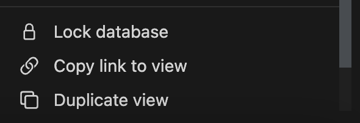
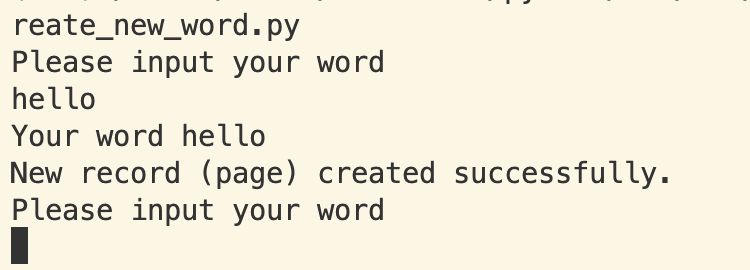
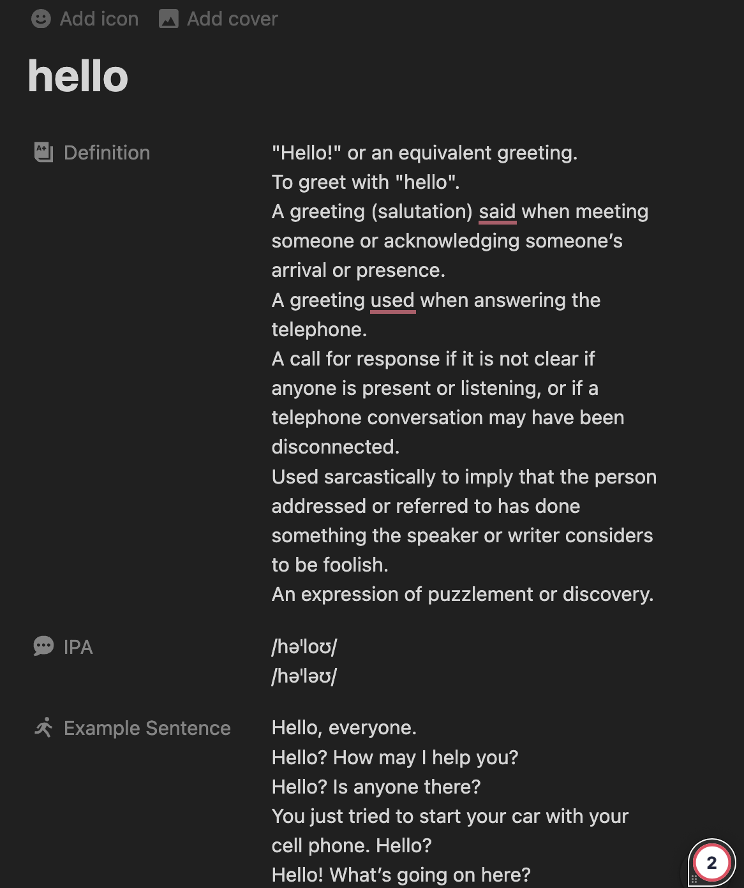

# Hướng dẫn import dữ liệu từ API từ điển vào notion chỉ bằng 1 thao tác

Hướng dẫn sau đây sẽ giúp bạn có giúp bạn thêm một **TỪ MỚI** vào database của bạn trên notion, ở đây tôi đang sử dụng một database có sẵn về việc học từ mới bằng phương pháp spaced repetition của Danyo Pang

Bạn có thể xem thêm template này tại trang web của notion: https://www.notion.so/templates/vocabulary-tracker-language-learning

## Bước 1

1. Đăng nhập vào notion clone lại template Vocabulary Tracker (Language Learning) của Danyo Pang

## Bước 2 Đăng ký vào tạo API notion

1. Đăng nhập vào tài khoản Notion của bạn.
2. Truy cập [Notion Developers](https://developers.notion.com/) và tạo một [Integration](https://www.notion.so/my-integrations) mới.
3. Đặt tên cho Integration của bạn và nhấn "Submit".
4. Sao chép mã Token đã tạo. Đây sẽ là cách bạn xác thực với API Notion.

## Bước 3 Cài đặt thư viện cho python

Ở đây chúng ta sẽ sử dụng thư viện `requests` một thư viện chuyên để làm việc với các yêu cầu HTTP và nhận phản hồi từ các máy chủ web hoặc API

```command
pip install requests
```

## Bước 4 làm quen với các API sử dụng trong ứng dụng

- API 1: Document API tạo mới một page [LINK API](https://developers.notion.com/reference/post-page)
- API 2: Document API từ điển [Link API](https://dictionaryapi.dev)

Với 2 API này ta có thể tự động hoá quá trình thêm mới một từ mới vào bộ từ điển của chúng ta bao gồm (name, meaning, IPA, example, ... và nhiều trường nữa nếu ta cần)

Một số lưu ý của API tạo mới page:

- Vì mình sử dụng database nên sẽ có một trường là database_id. Các bước để lấy như sau, bạn click vào view`...` trên cùng của database và click vào `Copy link to view`. Bạn sẽ có một định dạng như sau `https://www.notion.so/63eefad1dd0f49f280cfe46bee8858e2?v=ffc96cc522ec4c83be1a422d649c10a1&pvs=4`, `63eefad1dd0f49f280cfe46bee8858e2` chính là Id mà bạn cần tìm
  

## Bước 5: Viết code

Mình đã viết code chi tiết trong file `create_new_word.py`

Idea của bài toán mình sẽ nhập một từ từ command line sau đó sẽ gọi API dictionary để lấy các thôn tin của từ mới, và cuối cùng sẽ gọi API tạo mới page trong database

## Bước 6: Chạy thử và demo

- Chạy thử

  

- sau khi hoàn thành

  
